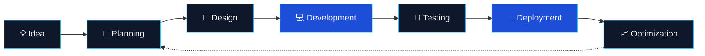

<div align="center">


<br/>

<a href="https://github.com/Coldzy213">
  
</a>
<a href="https://linkedin.com/in/drewzamora">
  
</a>
<a href="mailto:zamoradrew213@gmail.com">
  
</a>

<br/><br/>


<br/>


</div>

---

## ⚡ Developer.exe

```javascript
class Developer {
  constructor() {
    this.name = "Raul Andrew Zamora";
    this.alias = "Drew";
    this.role = "Full-Stack & Mobile Developer";
    this.education = "BS Information Technology";
    this.major = "Programming";
    this.location = "Philippines";
  }

  get techStack() {
    return {
      backend: ["Laravel", "PHP", "Python", "FastAPI"],
      frontend: ["Next.js", "React", "JavaScript"],
      mobile: ["React Native", "Expo"],
      databases: ["MySQL", "PostgreSQL", "SQLite"],
      machineLearning: [
        "PyTorch",
        "TensorFlow",
        "YOLO",
        "Roboflow"
      ],
      tools: ["Git", "GitHub", "VS Code", "Unity", "Blender"]
    };
  }

  get currentFocus() {
    return [
      "Building scalable web applications",
      "Developing cross-platform mobile apps",
      "Integrating Artificial Intelligence",
      "Exploring Computer Vision",
      "Improving backend architecture"
    ];
  }

  introduce() {
    return "I don't just write code. I build solutions.";
  }
}

const drew = new Developer();
console.log(drew.introduce());
```

---

## 🧠 About Me

```text
╔════════════════════════════════════════════════════════════╗
║                    DEVELOPER PROFILE                       ║
╠════════════════════════════════════════════════════════════╣
║  Name       : Raul Andrew Zamora                           ║
║  Alias      : Drew                                         ║
║  Education  : BS Information Technology                    ║
║  Major      : Programming                                 ║
║  Specialty  : Backend, Web, Mobile & AI                    ║
║  Location   : Philippines                                 ║
║  Philosophy : Code is Language.                            ║
╚════════════════════════════════════════════════════════════╝
```

I'm an **Information Technology graduate majoring in Programming**, passionate about building applications that solve real-world problems.

My strongest experience is in **Laravel backend development, REST API architecture, and database-driven applications**.

I also enjoy creating modern interfaces with **Next.js and React**, developing mobile experiences using **React Native and Expo**, and exploring **Machine Learning, Artificial Intelligence, and Computer Vision**.

I believe great software is built through continuous learning, experimentation, and attention to detail.

---

## 🛠️ Technology Arsenal

<div align="center">

### `01 / PROGRAMMING LANGUAGES`


<br/><br/>

### `02 / FRONTEND ENGINEERING`


<br/><br/>

### `03 / BACKEND ENGINEERING`


<br/><br/>

### `04 / MOBILE ENGINEERING`


<br/>

**React Native • Expo • Android Development**

<br/>

### `05 / MACHINE LEARNING & AI`


<br/>

**Ultralytics YOLO • Roboflow • Object Detection • Computer Vision**

<br/><br/>

### `06 / DATABASE SYSTEMS`


<br/><br/>

### `07 / DEVELOPMENT TOOLS`


<br/><br/>

### `08 / GAME DEVELOPMENT & 3D`


</div>

---

## 🚀 Engineering Capabilities

<div align="center">

| Domain | Technologies & Experience |
|:---:|:---|
| ⚙️ **Backend Development** | Laravel, FastAPI, PHP, Python |
| 🌐 **Frontend Development** | Next.js, React.js, JavaScript, Tailwind CSS |
| 📱 **Mobile Development** | React Native, Expo, Android |
| 🧠 **Machine Learning** | PyTorch, TensorFlow, YOLO |
| 👁️ **Computer Vision** | Object Detection, Image Processing, Roboflow |
| 🗄️ **Database Engineering** | MySQL, PostgreSQL, SQLite |
| 🔌 **API Engineering** | REST APIs, Authentication, Integrations |
| ☁️ **Deployment** | Render, Vercel, Railway |
| 🎮 **3D Development** | Unity, Blender, C# |

</div>

---

## 📊 GitHub Intelligence Dashboard

<div align="center">


<br/>




<br/><br/>



</div>

---

## 📈 Contribution Activity

<div align="center">


</div>

---

## 🐍 Contribution Snake

<div align="center">

<picture>
  <source media="(prefers-color-scheme: dark)" srcset="./profile/github-contribution-grid-snake-dark.svg" />
  <source media="(prefers-color-scheme: light)" srcset="./profile/github-contribution-grid-snake.svg" />
  
</picture>

<br/>

*Every contribution is another step forward.*

</div>

---

## 🧩 Development Workflow



---

## 🔭 Currently Exploring

<div align="center">


<br/>


</div>

---

## 💻 Developer Mindset

<div align="center">

```text
> developer --status

[✓] Passionate about clean and maintainable code
[✓] Building modern web applications
[✓] Developing mobile experiences
[✓] Exploring intelligent AI solutions
[✓] Learning new technologies
[✓] Turning complex problems into simple solutions

SYSTEM STATUS: ALWAYS BUILDING...
```


</div>

---

## 🌐 Connect With Me

<div align="center">

<a href="https://github.com/Coldzy213">
  
</a>

<a href="https://linkedin.com/in/drewzamora">
  
</a>

<a href="mailto:zamoradrew213@gmail.com">
  
</a>

<br/><br/>

**Open to collaboration, learning opportunities, and building meaningful software.**

<br/>

### `> Code is Language.`


<br/>


</div>
