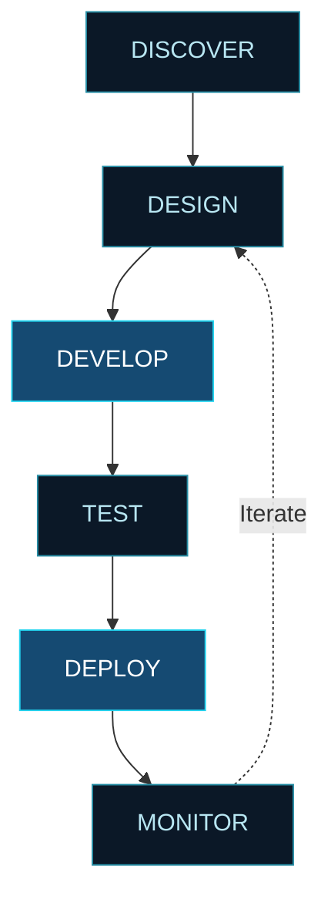

<!--
  PROFILE: Raul Andrew Zamora (Drew)
  THEME: developer control room / midnight / electric cyan
  INTERACTION: anchor links + collapsible panels
  MOTION: local SVG animations + remote typing/activity SVGs
  No JavaScript, custom CSS, or emoji required in GitHub Markdown.
-->

<div align="center">

<a href="https://github.com/Coldzy213">
  
</a>

<br/>


<p>
  <a href="https://github.com/Coldzy213?tab=repositories"></a>
  <a href="https://linkedin.com/in/drewzamora"></a>
  <a href="mailto:zamoradrew213@gmail.com"></a>
</p>

<p>
  
  
  
</p>

<br/>

<table>
  <tr>
    <td align="center"><a href="#profile"><b>PROFILE</b></a></td>
    <td align="center"><a href="#tech-stack"><b>TECH STACK</b></a></td>
    <td align="center"><a href="#projects"><b>PROJECTS</b></a></td>
  </tr>
  <tr>
    <td align="center"><a href="#analytics"><b>ANALYTICS</b></a></td>
    <td align="center"><a href="#activity"><b>ACTIVITY</b></a></td>
    <td align="center"><a href="#contact"><b>CONTACT</b></a></td>
  </tr>
</table>

</div>

<br/>

<a id="profile"></a>
## `01` / SYSTEM.IDENTITY

> I build **backend systems, web applications, and cross-platform mobile experiences**, with a strong interest in bringing **machine learning and computer vision** into practical products. My main focus is Laravel backend engineering, clean API design, and thoughtful integrations across the stack.

<table>
<tr>
<td valign="top" width="60%">

```bash
$ developer --info

NAME           Raul Andrew Zamora
ALIAS          Drew
ROLE           Full-Stack / Mobile Developer
EDUCATION      BS Information Technology, Major in Programming
CORE           Laravel / REST APIs / Next.js / React Native
EXPLORING      Artificial Intelligence / Computer Vision
LOCATION       Philippines

$ developer --motto
> Code is Language.
```

</td>
<td valign="top" width="40%">

<details>
<summary><b>[ + ] OPEN / DEVELOPER CONFIGURATION</b></summary>

<br/>

```javascript
const drew = {
  name: "Raul Andrew Zamora",
  alias: "Drew",
  role: "Full-Stack & Mobile Developer",
  primary: ["Laravel", "REST APIs", "Next.js", "React Native"],
  exploring: ["FastAPI", "PyTorch", "YOLO", "Computer Vision"],
  principles: ["Build", "Test", "Refine", "Ship"],
  motto: "Code is Language."
};
```

</details>

</td>
</tr>
</table>

<br/>

<a id="tech-stack"></a>
## `02` / TECHNOLOGY.MODULES

<table>
  <tr>
    <td align="center">
      <br/>
      
      <br/><br/>
    </td>
  </tr>
  <tr>
    <td align="center">
      <br/>
      
      <br/><br/>
    </td>
  </tr>
</table>

<br/>

<details open>
<summary><b>[ 01 ] BACKEND ENGINEERING</b> — APIs, services, database systems</summary>

<br/>


> **Focus:** Laravel applications, REST API development, authentication, server-side logic, relational databases, and integrations.

</details>

---

<details>
<summary><b>[ 02 ] FRONTEND ENGINEERING</b> — web interfaces and applications</summary>

<br/>


> **Focus:** Responsive interfaces, component-based architecture, web applications, and API-connected frontends.

</details>

---

<details>
<summary><b>[ 03 ] MOBILE ENGINEERING</b> — cross-platform applications</summary>

<br/>


> **Focus:** React Native, Expo, mobile UI, navigation, client-side state, and backend connectivity.

</details>

---

<details>
<summary><b>[ 04 ] MACHINE LEARNING</b> — vision and intelligent applications</summary>

<br/>


> **Focus:** Ultralytics YOLO, Roboflow, object detection, model integration, and computer vision experiments.

</details>

---

<details>
<summary><b>[ 05 ] DEVELOPMENT TOOLCHAIN</b> — development, deployment, and 3D</summary>

<br/>


> **Focus:** Git workflows, debugging, API testing, cloud deployment, Unity, and Blender.

</details>

<br/>

<a id="projects"></a>
## `03` / PROJECT.EXPLORER

A shortcut to my public code and development activity. Select a route to explore.

| ROUTE | DESTINATION | ACTION |
|:--|:--|:--:|
| `~/repositories` | Public code and projects | [OPEN](https://github.com/Coldzy213?tab=repositories) |
| `~/repositories?language=PHP` | PHP and Laravel-focused code | [OPEN](https://github.com/Coldzy213?tab=repositories&language=PHP) |
| `~/repositories?language=Python` | Python and ML-related code | [OPEN](https://github.com/Coldzy213?tab=repositories&language=Python) |
| `~/stars` | Tools and repositories I follow | [OPEN](https://github.com/Coldzy213?tab=stars) |

<details>
<summary><b>[ + ] OPEN / DEVELOPMENT PIPELINE</b></summary>

<br/>



</details>

<br/>

<a id="analytics"></a>
## `04` / GITHUB.TELEMETRY

<table>
  <tr>
    <td align="center" width="50%">
      <a href="https://github.com/Coldzy213"></a>
    </td>
    <td align="center" width="50%">
      <a href="https://github.com/Coldzy213?tab=repositories"></a>
    </td>
  </tr>
  <tr>
    <td colspan="2" align="center">
      <a href="https://github.com/Coldzy213"></a>
    </td>
  </tr>
</table>

<details>
<summary><b>[ + ] OPEN / ACTIVITY GRAPH</b></summary>

<br/>

<div align="center">


</div>

</details>

<br/>

<a id="activity"></a>
## `05` / CONTRIBUTION.STREAM

<table>
  <tr>
    <td align="center">
      <picture>
        <source media="(prefers-color-scheme: dark)" srcset="./profile/github-contribution-grid-snake-dark.svg" />
        <source media="(prefers-color-scheme: light)" srcset="./profile/github-contribution-grid-snake.svg" />
        
      </picture>
    </td>
  </tr>
</table>

<details>
<summary><b>[ + ] OPEN / ENGINEERING PRINCIPLES</b></summary>

<br/>

```text
[01] THINK IN SYSTEMS
[02] DESIGN FOR CLARITY
[03] BUILD FOR MAINTAINABILITY
[04] TEST WHAT MATTERS
[05] AUTOMATE THE REPETITIVE
[06] KEEP LEARNING
```

</details>

<br/>

<a id="contact"></a>
## `06` / ESTABLISH.CONNECTION

<div align="center">

<br/>

<p>
  <a href="https://github.com/Coldzy213"></a>
  <a href="https://linkedin.com/in/drewzamora"></a>
  <a href="mailto:zamoradrew213@gmail.com"></a>
</p>

<br/>


<br/><br/>



</div>
